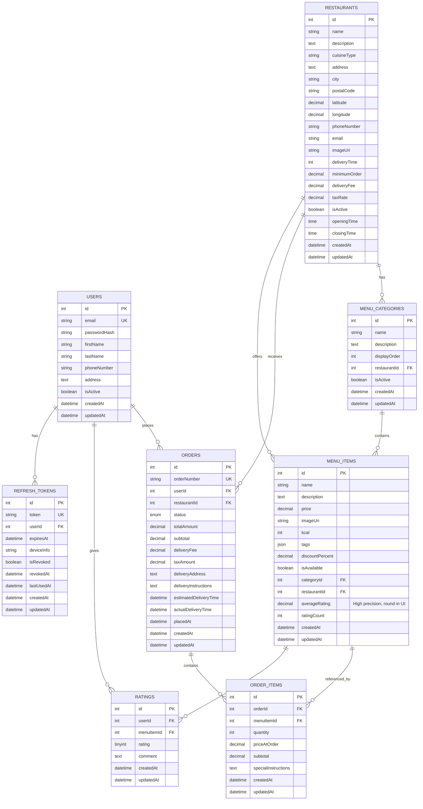

# Database Documentation

This directory contains comprehensive documentation for the EatWithSam backend database schema.

## Overview

The database is designed for a food delivery system using **MySQL** with **Sequelize ORM**. The schema supports user authentication, restaurant management, menu management, order processing, and rating systems.

## Table of Contents

- [Schema Overview](./schema-overview.md) - Entity relationships and database structure
- [Users Table](./tables/users.md) - User accounts and authentication
- [RefreshTokens Table](./tables/refresh-tokens.md) - JWT refresh token storage
- [Restaurants Table](./tables/restaurants.md) - Restaurant information
- [Menu Tables](./tables/menu.md) - Menu categories and menu items
- [Orders Tables](./tables/orders.md) - Orders and order items
- [Ratings Table](./tables/ratings.md) - Menu item ratings and reviews

## Database Technology

- **Database**: MySQL 5.7+
- **ORM**: Sequelize 6.x
- **Connection**: Configured in `config/database.ts`

## Quick Reference

### Core Entities

| Entity | Purpose | Key Relationships |
|--------|---------|-------------------|
| **Users** | Customer accounts | → Orders (1:many), → Ratings (1:many), → RefreshTokens (1:many) |
| **Restaurants** | Restaurant information | → MenuCategories (1:many), → Orders (1:many) |
| **MenuCategories** | Menu organization | ← Restaurants (many:1), → MenuItems (1:many) |
| **MenuItems** | Individual dishes/products | ← MenuCategories (many:1), ← Restaurants (many:1), → OrderItems (1:many), → Ratings (1:many) |
| **Orders** | Order headers | ← Users (many:1), ← Restaurants (many:1), → OrderItems (1:many) |
| **OrderItems** | Order line items | ← Orders (many:1), ← MenuItems (many:1) |
| **Ratings** | User reviews | ← Users (many:1), ← MenuItems (many:1) |
| **RefreshTokens** | JWT refresh token storage | ← Users (many:1) |

## Entity Relationship Diagram

For detailed relationship explanations, see [Schema Overview](./schema-overview.md).

## Database Operations

### Seeding Data

The database uses Faker.js for generating test data. See [Seeders Documentation](../../seeders/README.md) for details.

### Migrations

Database schema changes are managed through Sequelize migrations (to be implemented).

### Examples

Validation scripts and examples for design decisions are available in the [examples](./examples/) directory:
- [Rating Precision Validation](./examples/rating-precision-validation.ts) - Demonstrates why `DECIMAL(9, 8)` precision is necessary for average ratings

## Performance Considerations

- Indexes are added on foreign keys and frequently queried fields
- Order queries are optimized for handling 10,000+ orders
- Proper indexing on `userId`, `restaurantId`, `orderId`, `menuItemId` for join performance

